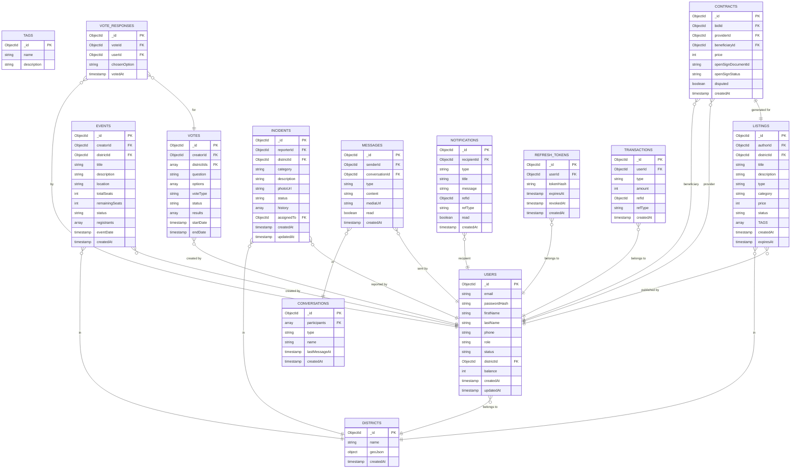

# MongoDB — Collections

```mermaid
erDiagram

  USERS {
    ObjectId _id PK
    string email
    string passwordHash
    string firstName
    string lastName
    string phone
    string role
    string status
    ObjectId districtId FK
    int balance
    timestamp createdAt
    timestamp updatedAt
  }

  DISTRICTS {
    ObjectId _id PK
    string name
    object geoJson
    timestamp createdAt
  }

  LISTINGS {
    ObjectId _id PK
    ObjectId authorId FK
    ObjectId districtId FK
    string title
    string description
    string type
    string category
    int price
    string status
    array TAGS
    timestamp createdAt
    timestamp expiresAt
  }

  TAGS {
    ObjectId _id PK
    string name
    string description
  }

  CONTRACTS {
    ObjectId _id PK
    ObjectId bidId FK
    ObjectId providerId FK
    ObjectId beneficiaryId FK
    int price
    string openSignDocumentId
    string openSignStatus
    boolean disputed
    timestamp createdAt
  }

  EVENTS {
    ObjectId _id PK
    ObjectId creatorId FK
    ObjectId districtId FK
    string title
    string description
    string location
    int totalSeats
    int remainingSeats
    string status
    array registrants
    timestamp eventDate
    timestamp createdAt
  }

  VOTES {
    ObjectId _id PK
    ObjectId creatorId FK
    array districtIds FK
    string question
    array options
    string voteType
    string status
    array results
    timestamp startDate
    timestamp endDate
  }

  VOTE_RESPONSES {
    ObjectId _id PK
    ObjectId voteId FK
    ObjectId userId FK
    string chosenOption
    timestamp votedAt
  }

  INCIDENTS {
    ObjectId _id PK
    ObjectId reporterId FK
    ObjectId districtId FK
    string category
    string description
    string photoUrl
    string status
    array history
    ObjectId assignedTo FK
    timestamp createdAt
    timestamp updatedAt
  }

  CONVERSATIONS {
    ObjectId _id PK
    array participants FK
    string type
    string name
    timestamp lastMessageAt
    timestamp createdAt
  }

  MESSAGES {
    ObjectId _id PK
    ObjectId senderId FK
    ObjectId conversationId FK
    string type
    string content
    string mediaUrl
    boolean read
    timestamp createdAt
  }

  NOTIFICATIONS {
    ObjectId _id PK
    ObjectId recipientId FK
    string type
    string title
    string message
    ObjectId refId
    string refType
    boolean read
    timestamp createdAt
  }

  REFRESH_TOKENS {
    ObjectId _id PK
    ObjectId userId FK
    string tokenHash
    timestamp expiresAt
    timestamp revokedAt
    timestamp createdAt
  }

  TRANSACTIONS {
    ObjectId _id PK
    ObjectId userId FK
    string type
    int amount
    ObjectId refId
    string refType
    timestamp createdAt
  }

  USERS               }o--||  DISTRICTS           : "belongs to"
  LISTINGS            }o--||  USERS               : "published by"
  LISTINGS            }o--||  DISTRICTS           : "in"
  CONTRACTS           ||--||  LISTINGS            : "generated for"
  CONTRACTS           }o--||  USERS               : "provider"
  CONTRACTS           }o--||  USERS               : "beneficiary"
  EVENTS              }o--||  USERS               : "created by"
  EVENTS              }o--||  DISTRICTS           : "in"
  VOTES               }o--||  USERS               : "created by"
  VOTE_RESPONSES      }o--||  VOTES               : "for"
  VOTE_RESPONSES      }o--||  USERS               : "by"
  INCIDENTS           }o--||  USERS               : "reported by"
  INCIDENTS           }o--||  DISTRICTS           : "in"
  MESSAGES            }o--||  USERS               : "sent by"
  MESSAGES            }o--||  CONVERSATIONS       : "in"
  NOTIFICATIONS       }o--||  USERS               : "recipient"
  TRANSACTIONS        }o--||  USERS               : "belongs to"
  REFRESH_TOKENS      }o--||  USERS               : "belongs to"
```
