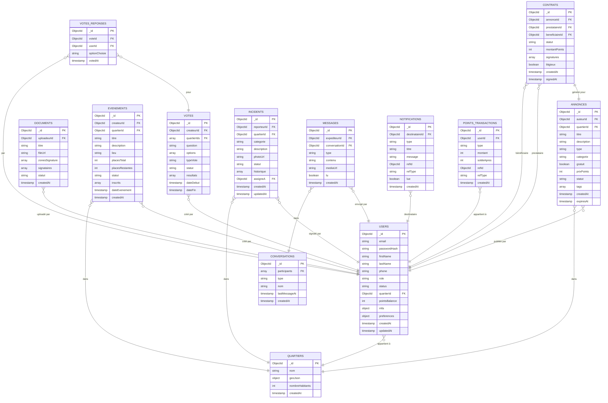

# MongoDB — Collections

```mermaid
erDiagram

  USERS {
    ObjectId _id PK
    string email
    string passwordHash
    string firstName
    string lastName
    string phone
    string role
    string status
    ObjectId quartierId FK
    int pointsBalance
    object mfa
    object preferences
    timestamp createdAt
    timestamp updatedAt
  }

  QUARTIERS {
    ObjectId _id PK
    string nom
    object geoJson
    int nombreHabitants
    timestamp createdAt
  }

  ANNONCES {
    ObjectId _id PK
    ObjectId auteurId FK
    ObjectId quartierId FK
    string titre
    string description
    string type
    string categorie
    boolean gratuit
    int prixPoints
    string statut
    array tags
    timestamp createdAt
    timestamp expiresAt
  }

  CONTRATS {
    ObjectId _id PK
    ObjectId annonceId FK
    ObjectId prestataireId FK
    ObjectId beneficiaireId FK
    string statut
    int montantPoints
    array signatures
    boolean litigieux
    timestamp createdAt
    timestamp signedAt
  }

  DOCUMENTS {
    ObjectId _id PK
    ObjectId uploadeurId FK
    string titre
    string fileUrl
    array zonesSignature
    array signataires
    string statut
    timestamp createdAt
  }

  EVENEMENTS {
    ObjectId _id PK
    ObjectId createurId FK
    ObjectId quartierId FK
    string titre
    string description
    string lieu
    int placesTotal
    int placesRestantes
    string statut
    array inscrits
    timestamp dateEvenement
    timestamp createdAt
  }

  VOTES {
    ObjectId _id PK
    ObjectId createurId FK
    array quartierIds FK
    string question
    array options
    string typeVote
    string statut
    array resultats
    timestamp dateDebut
    timestamp dateFin
  }

  VOTES_REPONSES {
    ObjectId _id PK
    ObjectId voteId FK
    ObjectId userId FK
    string optionChoisie
    timestamp votedAt
  }

  INCIDENTS {
    ObjectId _id PK
    ObjectId reporteurId FK
    ObjectId quartierId FK
    string categorie
    string description
    string photoUrl
    string statut
    array historique
    ObjectId assigneA FK
    timestamp createdAt
    timestamp updatedAt
  }

  CONVERSATIONS {
    ObjectId _id PK
    array participants FK
    string type
    string nom
    timestamp lastMessageAt
    timestamp createdAt
  }

  MESSAGES {
    ObjectId _id PK
    ObjectId expediteurId FK
    ObjectId conversationId FK
    string type
    string contenu
    string mediaUrl
    boolean lu
    timestamp createdAt
  }

  NOTIFICATIONS {
    ObjectId _id PK
    ObjectId destinataireId FK
    string type
    string titre
    string message
    ObjectId refId
    string refType
    boolean lue
    timestamp createdAt
  }

  POINTS_TRANSACTIONS {
    ObjectId _id PK
    ObjectId userId FK
    string type
    int montant
    int soldeApres
    ObjectId refId
    string refType
    timestamp createdAt
  }

  USERS                 }o--||  QUARTIERS           : "appartient à"
  ANNONCES              }o--||  USERS               : "publiée par"
  ANNONCES              }o--||  QUARTIERS           : "dans"
  CONTRATS              ||--||  ANNONCES            : "généré pour"
  CONTRATS              }o--||  USERS               : "prestataire"
  CONTRATS              }o--||  USERS               : "bénéficiaire"
  DOCUMENTS             }o--||  USERS               : "uploadé par"
  EVENEMENTS            }o--||  USERS               : "créé par"
  EVENEMENTS            }o--||  QUARTIERS           : "dans"
  VOTES                 }o--||  USERS               : "créé par"
  VOTES_REPONSES        }o--||  VOTES               : "pour"
  VOTES_REPONSES        }o--||  USERS               : "par"
  INCIDENTS             }o--||  USERS               : "signalé par"
  INCIDENTS             }o--||  QUARTIERS           : "dans"
  MESSAGES              }o--||  USERS               : "envoyé par"
  MESSAGES              }o--||  CONVERSATIONS       : "dans"
  NOTIFICATIONS         }o--||  USERS               : "destinataire"
  POINTS_TRANSACTIONS   }o--|| USERS                : "appartient à"
```
