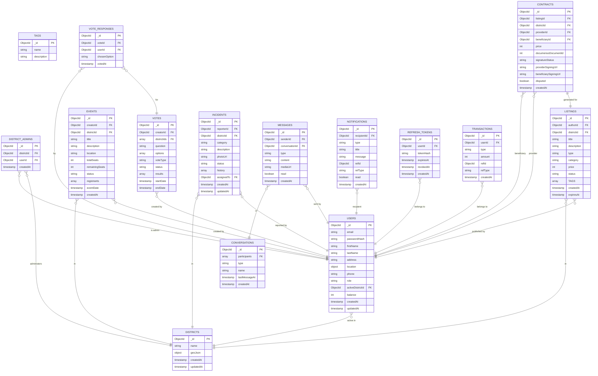

# MongoDB — Collections

> **v2 (feature change).** `users.districtId` (single) is replaced by `users.activeDistrictId` + a geocoded `users.location`; districts **may overlap** and their **names are not unique**; district-admin is modeled as the `DISTRICT_ADMINS` relationship (one district per admin, many admins per district). See `ROADMAP.md` §2A.

## Notes & indexes (v2)

- `users.location` — GeoJSON `Point` (`[lng, lat]`) geocoded from `address`; drives the eligible-district lookup. `users.role` ∈ `user | admin | superAdmin`.
- `users.activeDistrictId` — the single district that scopes the user's feed/listings/events/incidents; mutable (switching is server-side, no token change).
- `districts.geoJson` — GeoJSON `Polygon` with a **2dsphere** index; districts **may overlap** and **names are not unique** (identify by `_id`). The eligible set is computed via point-in-polygon over all boundaries.
- `district_admins` — unique index on `userId` enforces **one district per admin**; a district may have **many** admins. Read by the auth-service to mint the `adminDistrictId` JWT claim.
