# MongoDB — Collections

> Modèle de données tel qu'implémenté dans le code (entités `apps/api/src/entities/`,
> `apps/auth-service/src/entities/` et schémas partagés `@repo/shared`). La clé primaire
> `_id` est un **UUID applicatif (string)**, pas un `ObjectId` : les repositories insèrent
> `_id: randomUUID()` et `toEntity` le remappe vers `id` en sortie. Les références (FK) sont
> donc elles aussi des `string`. Le `districtId` cloisonne la quasi-totalité des collections
> métier (une donnée appartient à un quartier).

```mermaid
erDiagram

  USERS {
    string _id PK
    string email
    string passwordHash
    string firstName
    string lastName
    string phone
    string address
    string role
    string districtId FK
    int balance
    boolean banned
    boolean emailVerified
    string totpSecret
    boolean totpEnabled
    string lang
    int lastTotpStep
    timestamp createdAt
    timestamp updatedAt
  }

  DISTRICTS {
    string _id PK
    string name
    object geoJson
    int startingPoints
  }

  DISTRICT_ADMINS {
    string _id PK
    string districtId FK
    string userId FK
    timestamp createdAt
  }

  LISTINGS {
    string _id PK
    string authorId FK
    string districtId FK
    string title
    string description
    int price
    string status
    array tags
    array images
    timestamp createdAt
    timestamp expiresAt
  }

  TAGS {
    string _id PK
    string districtId FK
    string name
    object label
    object description
  }

  CONTRACTS {
    string _id PK
    string listingId FK
    string districtId FK
    string providerId FK
    string beneficiaryId FK
    int price
    int documensoDocumentId
    string signatureStatus
    string providerSigningUrl
    string beneficiarySigningUrl
    boolean disputed
    string disputeReason
    timestamp createdAt
  }

  EVENTS {
    string _id PK
    string creatorId FK
    string districtId FK
    string title
    string description
    string location
    int totalSeats
    int remainingSeats
    string status
    array registrants
    timestamp eventDate
    timestamp createdAt
  }

  EVENT_INTERACTIONS {
    string _id PK
    string eventId FK
    string userId FK
    string kind
    int rating
    int score
    timestamp at
  }

  VOTES {
    string _id PK
    string creatorId FK
    array districtIds FK
    string question
    array options
    string voteType
    string status
    array results
    timestamp startDate
    timestamp endDate
  }

  VOTE_RESPONSES {
    string _id PK
    string voteId FK
    string userId FK
    string chosenOption
    timestamp votedAt
  }

  INCIDENTS {
    string _id PK
    string reporterId FK
    string districtId FK
    string category
    string description
    string photoUrl
    string status
    array history
    string assignedTo FK
    timestamp createdAt
    timestamp updatedAt
  }

  CONVERSATIONS {
    string _id PK
    array participants FK
    string districtId FK
    string type
    string name
    timestamp lastMessageAt
    timestamp createdAt
  }

  MESSAGES {
    string _id PK
    string senderId FK
    string conversationId FK
    string districtId FK
    string type
    string content
    string mediaUrl
    boolean read
    timestamp createdAt
  }

  NOTIFICATIONS {
    string _id PK
    string recipientId FK
    string districtId FK
    string type
    string title
    string message
    string refId
    string refType
    boolean read
    timestamp createdAt
  }

  TRANSACTIONS {
    string _id PK
    string userId FK
    string districtId FK
    string type
    int amount
    string refId
    string refType
    timestamp createdAt
  }

  REFRESH_TOKENS {
    string _id PK
    string userId FK
    string tokenHash
    timestamp expiresAt
    date expiresAtDate
    timestamp revokedAt
    string sessionId
    string userAgent
    string ip
    timestamp lastUsedAt
    timestamp createdAt
  }

  AUTH_TOKENS {
    string _id PK
    string userId FK
    string tokenHash
    string type
    timestamp expiresAt
    timestamp usedAt
    timestamp createdAt
  }

  AUTHORIZATION_CODES {
    string _id PK
    string codeHash
    string clientId
    string userId FK
    string redirectUri
    string codeChallenge
    timestamp expiresAt
    date expiresAtDate
    timestamp usedAt
    timestamp createdAt
  }

  USERS               }o--||  DISTRICTS           : "réside dans"
  DISTRICT_ADMINS     }o--||  DISTRICTS           : "administre"
  DISTRICT_ADMINS     }o--||  USERS               : "est admin"
  TAGS                }o--||  DISTRICTS           : "dans"
  LISTINGS            }o--||  USERS               : "publiée par"
  LISTINGS            }o--||  DISTRICTS           : "dans"
  CONTRACTS           }o--||  LISTINGS            : "généré pour"
  CONTRACTS           }o--||  DISTRICTS           : "dans"
  CONTRACTS           }o--||  USERS               : "prestataire"
  CONTRACTS           }o--||  USERS               : "bénéficiaire"
  EVENTS              }o--||  USERS               : "créé par"
  EVENTS              }o--||  DISTRICTS           : "dans"
  EVENT_INTERACTIONS  }o--||  EVENTS              : "sur"
  EVENT_INTERACTIONS  }o--||  USERS               : "par"
  VOTES               }o--||  USERS               : "créé par"
  VOTES               }o--o{  DISTRICTS           : "porte sur"
  VOTE_RESPONSES      }o--||  VOTES               : "pour"
  VOTE_RESPONSES      }o--||  USERS               : "par"
  INCIDENTS           }o--||  USERS               : "signalé par"
  INCIDENTS           }o--||  DISTRICTS           : "dans"
  CONVERSATIONS       }o--||  DISTRICTS           : "dans"
  MESSAGES            }o--||  USERS               : "envoyé par"
  MESSAGES            }o--||  CONVERSATIONS       : "dans"
  MESSAGES            }o--||  DISTRICTS           : "dans"
  NOTIFICATIONS       }o--||  USERS               : "destinataire"
  NOTIFICATIONS       }o--||  DISTRICTS           : "dans"
  TRANSACTIONS        }o--||  USERS               : "appartient à"
  TRANSACTIONS        }o--||  DISTRICTS           : "dans"
  REFRESH_TOKENS      }o--||  USERS               : "appartient à"
  AUTH_TOKENS         }o--||  USERS               : "appartient à"
  AUTHORIZATION_CODES }o--||  USERS               : "appartient à"
```

## Collections partagées (api + auth-service)

`users` et `district_admins` sont physiquement partagées par les deux backends : leur forme
vit une seule fois dans `@repo/shared` (constantes `USERS_COLLECTION` / `DISTRICT_ADMINS_COLLECTION`).

- **`users`** — `role` ∈ `user | admin | superAdmin`. `districtId` est le **quartier unique**
  de rattachement du membre (feed / annonces / événements / signalements scopés). Champs d'auth
  et de MFA gérés par l'auth-service : `passwordHash` (argon2), `totpSecret` / `totpEnabled` /
  `lastTotpStep` (TOTP), `emailVerified`, `lang` (`fr` | `en`, langue des emails ; absence traitée
  comme `fr`). `balance` = solde de points (entier, défaut 0). `banned` = bannissement.
- **`district_admins`** — table de jointure user ⇄ quartier administré. **Index composé unique
  `(districtId, userId)`** : il empêche seulement le doublon d'un même couple ; un admin **peut**
  administrer plusieurs quartiers et un quartier avoir plusieurs admins. Lu par l'auth-service pour
  résoudre le claim `adminDistrictId` du JWT.

## Notes & index

- **`users`** — index sur `districtId` ; index **unique** sur `email`.
- **`districts`** — `geoJson` est une frontière GeoJSON (`Polygon`) indexée **2dsphere**, qui
  sous-tend `findDistrictsContaining` (point-in-polygon). `startingPoints` = points octroyés à un
  nouveau membre rejoignant le quartier. Pas d'horodatage dans le schéma.
- **`tags`** — clé stable `name` (stockée sur les annonces, utilisée comme filtre et clé de graphe) ;
  `label` / `description` portent le texte d'affichage par langue (`{ fr, en }`, `description`
  optionnelle). Index composé `(districtId, name)`.
- **`listings`** — `tags` = tableau de `name` de tags ; `images` = URLs (défaut liste vide) ; `status`
  ∈ `active | closed | expired`. Index sur `districtId`.
- **`contracts`** — matérialise un accord annonce/prestataire/bénéficiaire avec signature Documenso
  et séquestre de points. `signatureStatus` ∈ `draft | pending | completed | rejected` ;
  `documensoDocumentId` nullable (avant génération du document). Index : `districtId` ; **unique
  sparse** sur `documensoDocumentId` (lookup webhook) ; **unique partiel** sur
  `(listingId, providerId, beneficiaryId)` filtré sur `signatureStatus: "pending"` (au plus un
  contrat _actif_ par trio).
- **`events`** — `status` ∈ `upcoming | ongoing | completed | cancelled` (souvent recalculé depuis
  `eventDate` à la lecture) ; `registrants` = ids des inscrits. Index sur `districtId`.
- **`event_interactions`** — collection distincte, **source de vérité durable** des signaux de
  présence / intérêt répliqués dans Neo4j pour la recommandation. `kind` ∈ `attendance` (avec
  `rating`) | `interest` (avec `score`) ; `at` = horodatage. Index **unique** `(eventId, userId, kind)`
  (un upsert par triplet) et index sur `userId`.
- **`votes`** — sondage rattaché à **un ou plusieurs quartiers** (`districtIds`), avec `results`
  agrégés ; `voteType` ∈ `single_choice | multiple_choice`, `status` ∈ `draft | open | closed`.
  Les champs `totalResponses` / `userHasVoted` / `myChosenOptions` sont **dérivés à la lecture**, pas
  stockés. Index sur `districtIds`. `vote_responses` : une ligne par option choisie.
- **`incidents`** — `status` ∈ `open | in_progress | resolved | closed` ; `history` = tableau
  d'entrées `{ status, note?, updatedBy, updatedAt }` ; `assignedTo` = référent (optionnel). Le champ
  interne `_sync` (provenance de la synchro offline) est retiré par `toEntity` avant sortie du
  repository. Index sur `districtId`.
- **`conversations`** / **`messages`** — deux collections. `type` conversation ∈ `direct | group` ;
  `type` message ∈ `text | image | audio | file` (`mediaUrl` pour les non-texte). Index sur
  `districtId` (sur `conversations`).
- **`notifications`** — `type` ∈ `listing | contract | event | message | vote | incident | system` ;
  `refId` / `refType` (deep-link) optionnels. Index sur `districtId`.
- **`transactions`** — grand livre des points. `type` ∈ `credit | debit | transfer_in | transfer_out` ;
  `amount` entier **signé** ; `refType` ∈ `contract | listing | event | manual | system`. Index sur
  `districtId`.

### Collections auth-service

- **`refresh_tokens`** — refresh token persistant (stocké en hash sha256). Chaque rotation crée une
  ligne partageant le `sessionId` de la famille (détection de réutilisation + vue « sessions
  actives »), avec `userAgent` / `ip` / `lastUsedAt`. **Index TTL** sur `expiresAtDate`
  (`expireAfterSeconds: 0`) — le moniteur TTL ignore la chaîne ISO `expiresAt`, d'où le champ `Date`
  BSON dédié.
- **`auth_tokens`** — tokens à usage unique envoyés par email (`type` ∈ `verify_email | reset_password`),
  stockés en hash (`tokenHash`), consommés via `usedAt`. Pas d'index déclaré (pas de TTL : purge
  logique par `usedAt`).
- **`authorization_codes`** — codes d'autorisation à usage unique du login PKCE de l'app desktop,
  stockés en hash. Liés au `clientId`, au `redirectUri` exact et au `codeChallenge` (S256). **Index
  TTL** sur `expiresAtDate` (`expireAfterSeconds: 0`, purge à ~60 s) et index **unique** sur `codeHash`
  (usage unique).
