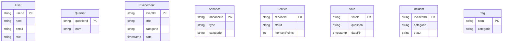

# Neo4j — Nœuds & Relations

### Nœuds



### Relations (Cypher)

```cypher
// ── Résidence ──────────────────────────────────────────────────────────────
(:User)-[:HABITE {depuis: date, adresse: string}]->(:Quartier)

// ── Réseau social ──────────────────────────────────────────────────────────
(:User)-[:CONNAIT {depuis: date, type: "voisin|ami"}]->(:User)
(:User)-[:SUIT]->(:User)

// ── Événements ─────────────────────────────────────────────────────────────
(:User)-[:A_CREE]->(:Evenement)
(:User)-[:INSCRIT_A {dateInscription: date, statut: string}]->(:Evenement)
(:User)-[:A_PARTICIPE {note: int}]->(:Evenement)
(:Quartier)-[:CONTIENT]->(:Evenement)
(:Evenement)-[:TAGUE]->(:Tag)

// ── Annonces & Services ────────────────────────────────────────────────────
(:User)-[:A_PUBLIE]->(:Annonce)
(:User)-[:REPOND_A {dateReponse: date}]->(:Annonce)
(:Annonce)-[:GENERE]->(:Service)
(:User)-[:PROPOSE {dateService: date}]->(:Service)
(:User)-[:BENEFICIE_DE {dateService: date, statut: string}]->(:Service)
(:Annonce)-[:TAGUE]->(:Tag)

// ── Votes ───────────────────────────────────────────────────────────────────
(:User)-[:A_VOTE {option: string, dateVote: date}]->(:Vote)
(:Quartier)-[:CONCERNE]->(:Vote)

// ── Incidents ──────────────────────────────────────────────────────────────
(:User)-[:A_SIGNALE]->(:Incident)
(:Quartier)-[:CONTIENT]->(:Incident)

// ── Recommandation (moteur Neo4j) ──────────────────────────────────────────
(:User)-[:INTERESSE_PAR {score: float, updatedAt: date}]->(:Tag)
(:User)-[:RECOMMANDE]->(:Evenement)
```
