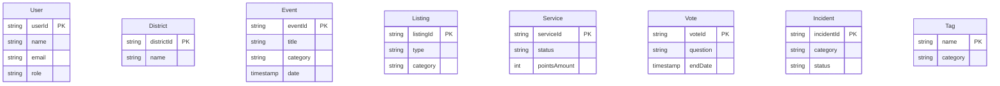

# Neo4j — Nodes & Relationships

### Nodes



### Relationships (Cypher)

```cypher
// ── Residence ──────────────────────────────────────────────────────────────
(:User)-[:LIVES_IN {since: date, address: string}]->(:District)

// ── Social network ─────────────────────────────────────────────────────────
(:User)-[:KNOWS {since: date, type: "neighbor|friend"}]->(:User)
(:User)-[:FOLLOWS]->(:User)

// ── Events ─────────────────────────────────────────────────────────────────
(:User)-[:CREATED]->(:Event)
(:User)-[:REGISTERED_FOR {registrationDate: date, status: string}]->(:Event)
(:User)-[:ATTENDED {rating: int}]->(:Event)
(:District)-[:CONTAINS]->(:Event)
(:Event)-[:TAGGED]->(:Tag)

// ── Listings & Services ────────────────────────────────────────────────────
(:User)-[:PUBLISHED]->(:Listing)
(:User)-[:REPLIED_TO {replyDate: date}]->(:Listing)
(:Listing)-[:GENERATES]->(:Service)
(:User)-[:OFFERS {serviceDate: date}]->(:Service)
(:User)-[:BENEFITS_FROM {serviceDate: date, status: string}]->(:Service)
(:Listing)-[:TAGGED]->(:Tag)

// ── Votes ───────────────────────────────────────────────────────────────────
(:User)-[:VOTED {option: string, voteDate: date}]->(:Vote)
(:District)-[:CONCERNS]->(:Vote)

// ── Incidents ──────────────────────────────────────────────────────────────
(:User)-[:REPORTED]->(:Incident)
(:District)-[:CONTAINS]->(:Incident)

// ── Recommendation (Neo4j engine) ──────────────────────────────────────────
(:User)-[:INTERESTED_IN {score: float, updatedAt: date}]->(:Tag)
(:User)-[:RECOMMENDED]->(:Event)
```
