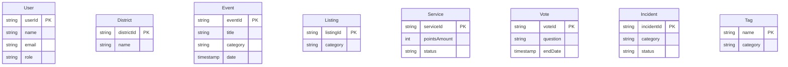

# Neo4j — Nodes & Relationships

> Projection graphe du domaine métier telle qu'écrite par le repository Neo4j
> (`apps/api/src/repositories/Graph/graph.repository.neo4j.ts`). Mongo reste la source de
> vérité ; Neo4j ne stocke qu'un **sous-ensemble d'attributs** par node plus les relations
> nécessaires aux traversées et au moteur de recommandation. La synchro est en **dual-write**
> best-effort (`syncGraph` : log + on continue) ; le cas d'usage `rebuildGraph` reconstruit toute
> la projection depuis Mongo. Toutes les écritures utilisent `MERGE` (upsert idempotent).

### Nodes


```mermaid
erDiagram

  User {
    string userId PK
    string name
    string email
    string role
  }

  District {
    string districtId PK
    string name
  }

  Event {
    string eventId PK
    string title
    string category
    timestamp date
  }

  Listing {
    string listingId PK
    string category
  }

  Service {
    string serviceId PK
    int pointsAmount
    string status
  }

  Vote {
    string voteId PK
    string question
    timestamp endDate
  }

  Incident {
    string incidentId PK
    string category
    string status
  }

  Tag {
    string name PK
    string category
  }
```

> `category` (`Event`, `Listing`, `Tag`) est optionnel : mis à `null` dans le `MERGE` quand il
> est absent. Le node `Service` n'est écrit que par les relations `GENERATES` / `OFFERS` /
> `BENEFITS_FROM` (chaîne annonce payante → contrat), hors périmètre de `rebuildGraph`.

### Relationships (Cypher)

```cypher
// ── Résidence ──────────────────────────────────────────────────────────────
(:User)-[:LIVES_IN {since: date, address: string}]->(:District)

// ── Réseau social ──────────────────────────────────────────────────────────
(:User)-[:KNOWS]->(:User)

// ── Événements ─────────────────────────────────────────────────────────────
(:User)-[:CREATED]->(:Event)
(:User)-[:REGISTERED_FOR {registrationDate: date, status: string}]->(:Event)
(:User)-[:ATTENDED {rating: int}]->(:Event)
(:District)-[:CONTAINS]->(:Event)
(:Event)-[:TAGGED]->(:Tag)

// ── Annonces & Services ────────────────────────────────────────────────────
(:User)-[:PUBLISHED]->(:Listing)
(:User)-[:REPLIED_TO {replyDate: date}]->(:Listing)
(:Listing)-[:GENERATES]->(:Service)
(:User)-[:OFFERS {serviceDate: date}]->(:Service)
(:User)-[:BENEFITS_FROM {serviceDate: date, status: string}]->(:Service)
(:Listing)-[:TAGGED]->(:Tag)

// ── Votes / sondages ───────────────────────────────────────────────────────
(:User)-[:VOTED {option: string, voteDate: date}]->(:Vote)
(:District)-[:CONCERNS]->(:Vote)

// ── Signalements ───────────────────────────────────────────────────────────
(:User)-[:REPORTED]->(:Incident)
(:District)-[:CONTAINS]->(:Incident)

// ── Recommandation (moteur Neo4j) ──────────────────────────────────────────
// UNE relation par couple (user, event), score cumulatif alimenté par les 👍/👎.
(:User)-[:INTERESTED_IN_EVENT {score: float, updatedAt: date}]->(:Event)
```

### Moteur de recommandation

Il n'existe **pas** de relation `RECOMMENDED` persistée. Les recommandations sont calculées à la
volée par `getRecommendedEventIds` (collaborative filtering, requête Cypher `INTERESTED_IN_EVENT`
en trois sauts) :

1. événements aimés par l'utilisateur (`score > 0`) ;
2. autres utilisateurs ayant aimé les mêmes événements (goûts similaires) ;
3. événements que ces utilisateurs ont aussi aimés, agrégés par `sum(score)` décroissant.

Sont exclus les événements que l'utilisateur a déjà engagés
(`INTERESTED_IN_EVENT | REGISTERED_FOR | ATTENDED`). La requête renvoie une liste ordonnée d'IDs ;
le cas d'usage `getEventRecommendations` récupère ensuite les documents complets dans Mongo.

> `linkUserInterestedInEvent(userId, eventId, scoreDelta)` **accumule** le score (clics 👍/👎) ;
> `setUserInterestedInEvent(userId, eventId, score)` **écrase** le score (seed idempotent). Les deux
> font un `MERGE` sur `User` et `Event` (création de node stub si non encore synchronisé).
