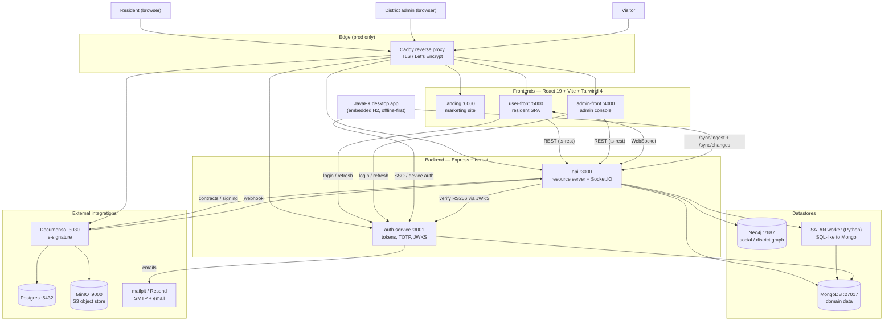
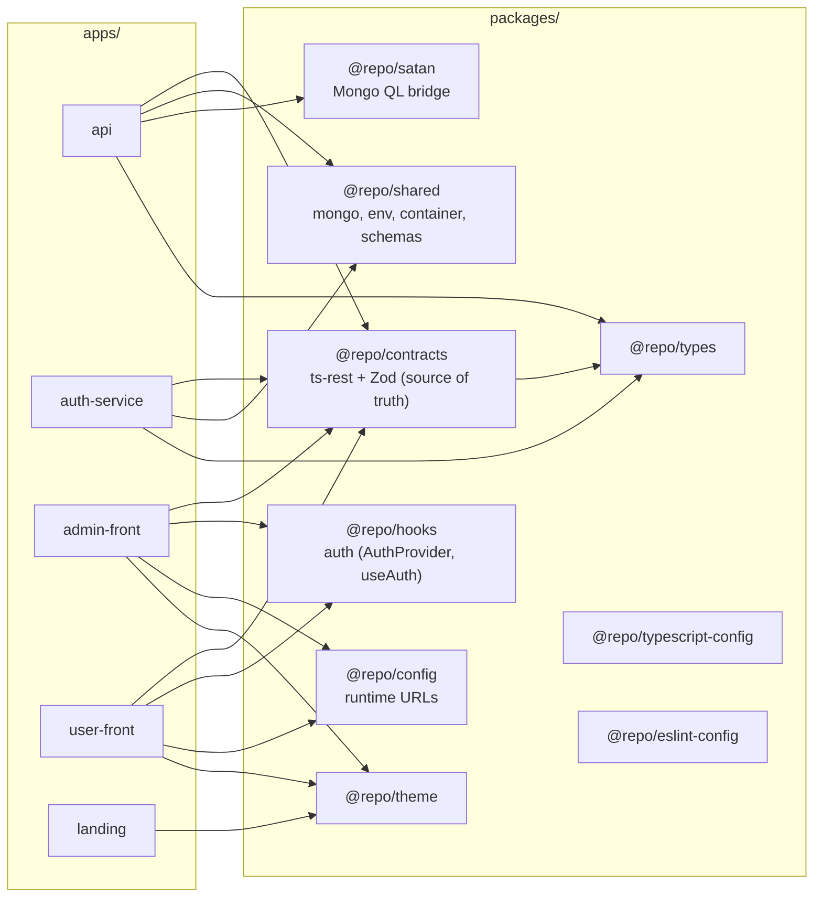
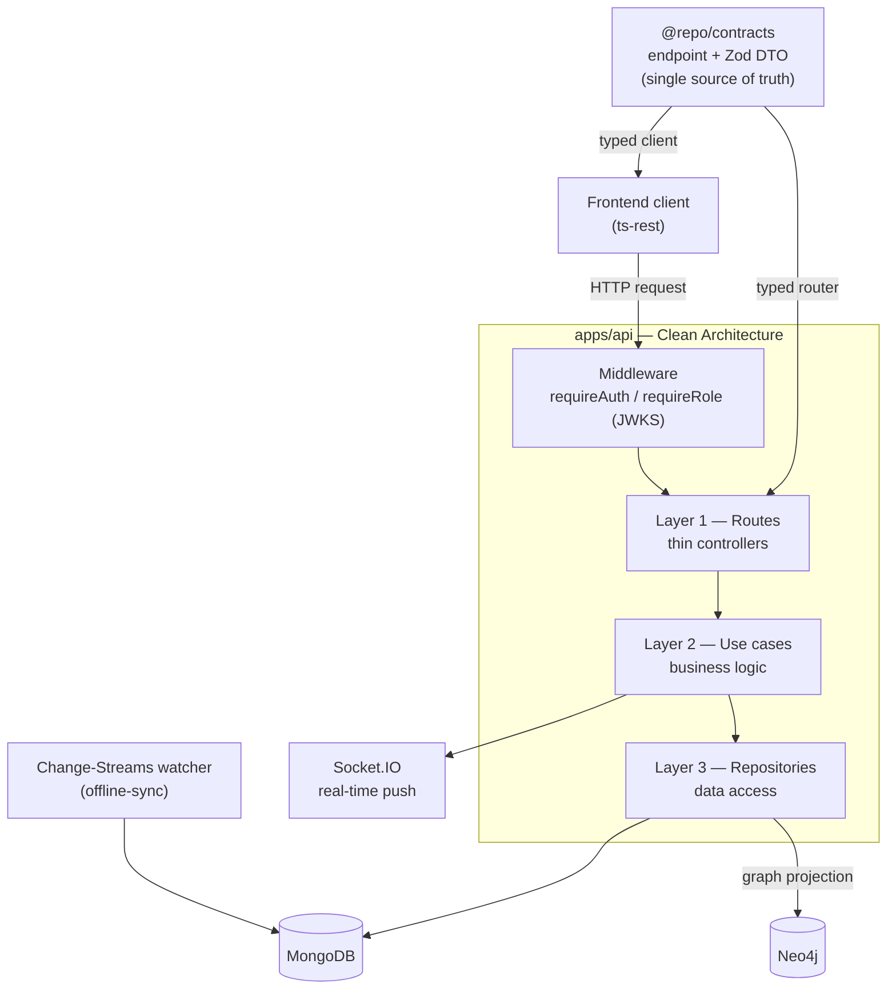
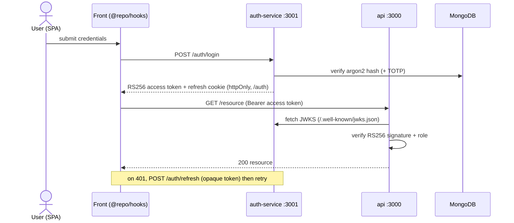
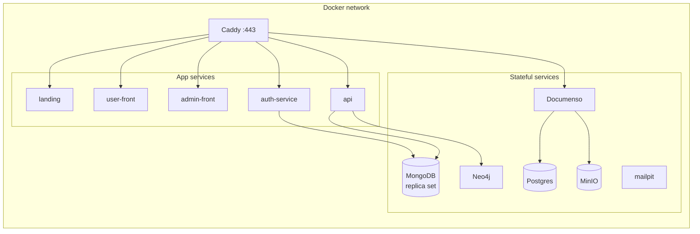

# Architecture Schema

Visual overview of the **Connected NeighBours** platform — a district-scoped
neighbourhood service exchange built as a Turborepo + npm workspaces monorepo.

This file complements the prose in [`architecture.md`](./architecture.md) with
rendered diagrams. Every diagram below is Mermaid and renders on GitHub.

---

## 1. System / container view

How the pieces fit together at runtime: actors, the production edge, the five
apps, the datastores, and the external Documenso e-signature stack. In dev the
apps are reached directly on their ports; in prod a Caddy reverse proxy
terminates TLS in front of them.

---

## 2. Monorepo dependency graph

The five apps share code through the `packages/*` workspaces.
`@repo/contracts` is the architectural core — the single source of truth for
every request/response shape, imported by both servers and clients.

> `@repo/typescript-config` and `@repo/eslint-config` are dev-time tooling
> bases consumed by every workspace; edges are omitted to keep the graph
> readable.

---

## 3. API — contract-first Clean Architecture

`apps/api` is a resource server organised in three concentric layers. The
contract package feeds both the typed frontend client and the server router, so
the API is type-safe end to end without code generation.

Domain modules follow the same routes → use-cases → repositories shape:
`users`, `districts`, `district-admins`, `listings`, `events`, `votes`,
`incidents`, `conversations`, `notifications`, `transactions`, `contracts`,
`tags`, `recommendations`, and `sync`.

---

## 4. Authentication flow (JWT RS256 + JWKS)

The `auth-service` owns credentials and issues tokens; the `api` never sees
passwords. It verifies access tokens against the auth-service JWKS, so there is
no shared secret between the two services.

- **Access tokens** — short-lived RS256 JWTs signed with `AUTH_PRIVATE_KEY`;
  the public key is published at `GET /.well-known/jwks.json`.
- **Refresh tokens** — opaque 64-byte hex, stored as sha256 in Mongo, delivered
  in an httpOnly cookie scoped to `/auth`.
- **Register** runs in the auth-service but creates the user through
  `POST API_URL/users`, authenticated with a short-lived self-signed
  `role: "service"` JWT.
- **Logged-out pages** — the auth-service also serves the standalone HTML
  screens for the credential flows: `/login`, `/register`, `/forgot-password`
  (enumeration-safe reset request) and the emailed `/reset-password` link.

---

## 5. Deployment topology

Both compose files describe the same services; they differ in intent.

| Concern       | `docker-compose.yml` (dev)                   | `docker-compose.deploy.yml` (prod)                     |
| ------------- | -------------------------------------------- | ------------------------------------------------------ |
| App images    | built from source, `dev` target, bind mounts | `ghcr.io/esgi-3al2-pa/web-apps/<app>` (nginx-served)   |
| TLS / routing | direct host ports                            | Caddy reverse proxy, Let's Encrypt                     |
| Secrets       | zero-config local credentials                | SOPS-decrypted env at deploy                           |
| Static hosts  | Vite dev server                              | `nginx-unprivileged` sending hardened security headers |
| Hot reload    | yes (`turbo run dev`)                        | no                                                     |

> MongoDB runs as a **replica set** — the Change-Streams watcher powering
> offline sync (`db.watch()`) requires one; it throws on a standalone mongod.

> The fronts bake their public `VITE_*` URLs into the bundle at build time
> (`VITE_API_URL`, `VITE_AUTH_SERVICE_URL`, `VITE_APP_URL`, `VITE_ADMIN_URL`,
> `VITE_LANDING_URL`). CD extracts them from `prod.enc.env` and passes them as
> Docker build args, so a URL change means a rebuild, not just a restart.

---

## Related documentation

- [`architecture.md`](./architecture.md) — full prose walkthrough
- [`auth-service.md`](./auth-service.md) — token flows in detail
- [`sync-gateway.md`](./sync-gateway.md) — offline sync (H2 ↔ MongoDB)
- [`satan-ql.md`](./satan-ql.md) — the SATAN query language
- [`documenso-integration.md`](./documenso-integration.md) — e-signature
- [`MCD/mongo.md`](./MCD/mongo.md) · [`MCD/neo4j.md`](./MCD/neo4j.md) — data models
