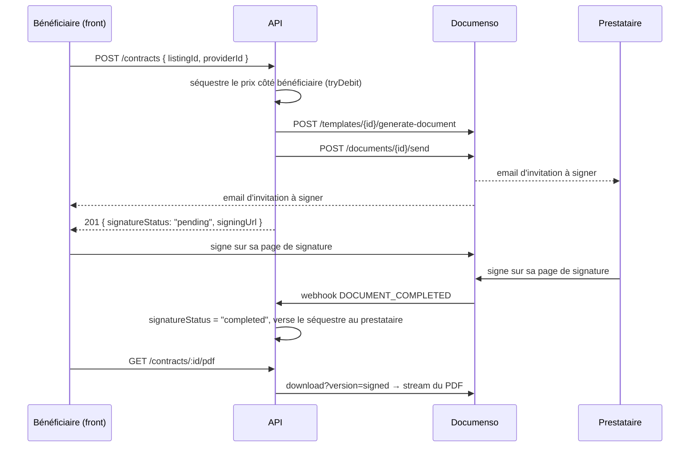

# Intégration Documenso (signature électronique des contrats)

## Vue d'ensemble

[Documenso](https://documenso.com) est un service de signature électronique open-source
(AGPL-3.0). Il tourne comme un **conteneur auto-hébergé séparé** aux côtés de la stack et
possède l'expérience de signature : recueil des signatures, envoi des emails
d'invitation et de complétion, application de l'ordre de signature, production du
certificat signé.

Tout le reste — la logique métier du contrat (annonce → parties → prix), la consultation
et l'aperçu du document, l'autorisation, le drapeau de litige — reste dans notre API et
nos fronts. Les utilisateurs ne gèrent jamais de document dans Documenso directement :
ils atterrissent seulement sur une **page de signature** Documenso via une URL de
signature propre à chaque destinataire, puis sont redirigés vers notre app.

Documenso est un service Next.js + **PostgreSQL** ; il ne partage pas notre Mongo. On ne
le joint qu'en HTTP, son framework est donc sans incidence sur nos fronts React/Vite.

> On épingle **Documenso v2.x** (`documenso/documenso:v2.15.0`). On intègre contre son
> **API REST v1**, dépréciée-mais-supportée sous v2 (« rien ne casse ») ; elle sert
> encore chaque endpoint qu'on appelle. Tout nouveau développement devrait cibler l'API v2.

> Choisi plutôt qu'OpenSign parce que l'API REST et les webhooks d'OpenSign sont une
> fonctionnalité **payante** en auto-hébergement, là où l'API REST + les webhooks de
> Documenso sont fournis dans l'édition Community gratuite.

---

## Architecture

L'API est l'orchestrateur. À la création du contrat, elle demande à Documenso de générer
un document **à partir d'un template pré-configuré**, stocke l'id de document renvoyé et
les URL de signature par partie, puis sert tout depuis notre base. Documenso n'est
recontacté que pour renvoyer les invitations, proxifier le PDF signé, ou supprimer le
document (effacement RGPD). À la fin de la signature (ou au refus), Documenso appelle
notre webhook pour qu'on mette à jour le statut du contrat et qu'on dénoue le séquestre.

- **Création :** `POST /contracts` → l'API appelle Documenso `generate-document` puis
  `documents/{id}/send` → stocke `documensoDocumentId` + les URL de signature → renvoie
  le contrat.
- **Signature :** l'utilisateur clique pour signer → le front le redirige vers _sa_ propre
  URL de signature Documenso.
- **Complétion :** Documenso déclenche un webhook → l'API met à jour `signatureStatus` et
  règle le séquestre (escrow).
- **Aperçu :** `GET /contracts/:id/pdf` proxifie le PDF signé depuis Documenso/S3 (une
  fois toutes les signatures apposées).

### Flux par template (pas d'upload par contrat)

Les contrats sont **toujours** créés depuis un template Documenso unique et pré-construit
via `generate-document`, jamais en uploadant un PDF par contrat. Le contenu du contrat
est donc fixe (le même document type pour toutes les réservations), et l'API n'a qu'à
résoudre les destinataires et les injecter dans le template.

Documenso tourne en transport de stockage objet **S3** (`NEXT_PUBLIC_UPLOAD_TRANSPORT=s3`,
adossé à MinIO). Ce transport est requis pour que l'API puisse **retélécharger le PDF
signé** via l'API v1 et l'afficher en aperçu in-app (`GET /contracts/:id/pdf`) — le
transport `database` (PDFs en Postgres) ne le permettrait pas.

---

## Composants

### `apps/api/src/services/documenso.service.ts`

Client léger au-dessus de l'**API REST v1** de Documenso (en-tête `Authorization: api_…`) :

- `generateContractDocument()` — résout les deux placeholders `SIGNER` du template
  (`GET /templates/{id}`, filtrés sur `role === "SIGNER"`, triés par `signingOrder` puis
  `id` : index 0 = prestataire, 1 = bénéficiaire ; échoue s'il y a moins de 2 signataires),
  appelle `POST /templates/{id}/generate-document` (avec `distributionMethod: "EMAIL"`,
  la langue de signature, et une `redirectUrl` optionnelle), **puis**
  `POST /documents/{id}/send` pour activer les tokens de signature des destinataires et
  déclencher les emails. Si le `send` échoue, le draft orphelin est supprimé
  (`DELETE /documents/{id}`) pour qu'une création ratée ne laisse rien. Réassocie enfin
  les URL de signature renvoyées à chaque partie par email.
- `resendDocument()` — récupère le document, puis renvoie l'invitation aux seuls
  signataires **pas encore signés** (`signingStatus !== "SIGNED"`), repli sur tous les
  signataires si le statut manque. Le `resend` de Documenso cible des destinataires par
  id ; une liste vide n'enverrait rien.
- `deleteDocument()` — `DELETE /documents/{id}` ; utilisé pour l'effacement RGPD des
  contrats `pending`/`draft` (le stand-in désactivé est un no-op, pour qu'une suppression
  de compte n'échoue pas si la stack e-signature ne tourne pas).
- `fetchSignedPdf()` — `GET /documents/{id}/download?version=signed`, puis récupère les
  octets depuis l'URL présignée renvoyée. Renvoie `null` si le document n'est pas encore
  terminé (Documenso répond 400 « not completed »).
- `verifyWebhookSecret()` — comparaison en temps constant (`timingSafeEqual`) de l'en-tête
  `X-Documenso-Secret` entrant.

> **Garde anti-SSRF sur le téléchargement du PDF.** `fetchSignedPdf` reçoit de Documenso
> une `downloadUrl` (URL présignée du stockage objet) qu'un Documenso compromis/mal
> configuré pourrait pointer vers une adresse interne. `assertAllowedDownloadUrl` rejette
> tout ce qui n'est pas du http(s) vers un hôte de l'allowlist. Celle-ci est dérivée de
> l'hôte de `DOCUMENSO_URL`, des endpoints MinIO connus de l'API, et d'un override
> explicite `DOCUMENSO_DOWNLOAD_HOSTS`.

#### Configuration & gestion des placeholders (#166)

`readConfig()` ne construit le vrai client HTTP que si `DOCUMENSO_URL`,
`DOCUMENSO_API_TOKEN` et `DOCUMENSO_TEMPLATE_ID` sont **réellement** configurés. Une valeur
n'est retenue que si elle est non vide **et n'est pas un placeholder d'échafaudage** : le
helper `configured()` trim la valeur et ignore tout marqueur `TODO-…` (les templates
`.env.dist` / SOPS en embarquent). Un `DOCUMENSO_TEMPLATE_ID` non numérique (ex.
`TODO-numeric-template-id`) est également traité comme non configuré, avec un
`logger.warn` — sinon il deviendrait `NaN` et appellerait silencieusement `/templates/NaN`.

Quand la config est incomplète, le service devient un **stand-in désactivé** dont chaque
appel lève `DocumensoServiceError` (mappé en 502 par le router), de sorte qu'un contrat ne
soit **jamais persisté sans document signable**. Séparément, si la config est complète mais
que `DOCUMENSO_WEBHOOK_SECRET` manque, un `logger.warn` avertit au boot : chaque webhook
serait alors rejeté (fail-closed) et les contrats resteraient bloqués en `pending`.

Un budget d'appel amont (`DOCUMENSO_TIMEOUT_MS = 15 s`, via `AbortSignal.timeout`) borne
chaque appel Documenso pour qu'un service bloqué ne fige pas la requête.

### Handler de webhook — `POST /contracts/webhook`

Handler Express brut (`routes/contracts/documenso-webhook.handler.ts`) monté **au-dessus**
de `requireAuth` dans `index.ts`, car Documenso s'authentifie avec le secret partagé, pas
notre JWT. Il :

1. vérifie `X-Documenso-Secret` (401 sinon) ;
2. valide la forme du payload avec un schéma zod `.passthrough()` (400 si malformé) ;
3. écarte les rejeux via une garde anti-rejeu en mémoire (voir ci-dessous) ;
4. délègue au cas d'usage, qui mappe l'événement vers une transition de statut.

Le mapping se fait sur **`payload.status`** (le `DocumentStatus` du document), pas sur le
nom de l'événement : `COMPLETED → completed`, `REJECTED → rejected`, `PENDING → pending`,
`DRAFT → draft`. Tout statut non reconnu renvoie `null` et l'événement est ignoré (le
contrat n'est pas touché) plutôt que forcé dans un état régressif. Le contrat est retrouvé
par `documensoDocumentId` (index unique, sparse).

Les transitions terminales (`completed`/`rejected`) et non-terminales sont toutes
**idempotentes et gardées atomiquement** :

- `completed`/`rejected` passent par `runInTransaction` : la transition de statut + le
  mouvement de solde + l'écriture de journal sont validés ou annulés ensemble, et la garde
  atomique garantit que le séquestre est versé/remboursé **au plus une fois**.
- une transition non-terminale (`pending`/`draft`) n'est appliquée que tant que le contrat
  **n'est pas déjà terminal** (`applyNonTerminalStatus`), pour qu'un événement tardif ou
  dans le désordre ne ramène pas un contrat `completed`/`rejected` vers `pending`.

> **Garde anti-rejeu.** Documenso n'envoie pas d'id de livraison unique. On dérive une clé
> `event:documentId:status` (`documensoWebhookReplayKey`) et un cache en mémoire à TTL
> (`WebhookReplayCache`, 5 min) écarte un renvoi déjà traité en l'acquittant `200`. C'est
> une défense en profondeur par-dessus les gardes atomiques ; la clé n'est mémorisée
> qu'**après** un `200` réussi, pour qu'une livraison ayant précédemment renvoyé `500` (et
> réessayée par Documenso) soit bien retraitée. Mono-processus uniquement — les verrous en
> base suffisent à l'idempotence entre instances.

### Proxy du PDF signé — `GET /contracts/:id/pdf`

Handler Express brut (`contract-pdf.handler.ts`), monté **sous** `requireAuth`, qui streame
le PDF signé depuis Documenso pour que le front ne parle jamais directement à Documenso/S3.
Il fait sa propre autorisation (partie, admin du quartier concerné, ou superAdmin ; 404 en
cas de refus pour ne pas divulguer l'existence du contrat) et renvoie `409` tant que le
contrat n'est pas entièrement signé (`fetchSignedPdf` renvoie `null`), `502` si Documenso
échoue. Le nom de fichier renvoyé par Documenso est assaini (CR/LF + guillemets retirés)
avant d'entrer dans l'en-tête `Content-Disposition`.

### Modèle de contrat

Stockés côté serveur : `documensoDocumentId` (numérique, `null` avant génération),
`signatureStatus` (`draft | pending | completed | rejected`), et les deux URL de signature
par partie. La réponse API n'expose que le `signingUrl` du **caller authentifié** — une URL
de signature porte un token qui autorise à signer _en tant que ce destinataire_, l'URL de
l'autre partie n'est donc jamais renvoyée, et aucune n'est renvoyée une fois le contrat
`completed`. Les champs `disputed` / `disputeReason` portent l'état de litige. À la
complétion ou au rejet, le repository met les deux URL de signature à `null` en base.

---

## Flux de signature

1. Le **bénéficiaire** (payeur) crée le contrat en nommant le prestataire →
   `POST /contracts`. L'auteur de l'annonce est le prestataire réservé ; l'appelant est
   toujours le bénéficiaire (les rôles ne sont pas dérivés d'un `type` d'annonce). L'annonce
   doit être `active`, et le `price` **comme** le `districtId` sont pris sur l'annonce, jamais
   du client. Le body ne contient que `listingId` + `providerId` ; un `providerId` qui ne
   correspond pas à l'auteur de l'annonce est rejeté (`403`).
2. Le `price` du bénéficiaire est mis **sous séquestre** (escrow — débité en amont via
   `tryDebit`) _avant_ tout travail externe. L'API appelle ensuite Documenso
   `generate-document` puis `send` (prestataire = signataire 1, bénéficiaire = 2). Si
   Documenso échoue, le séquestre est annulé (remboursé) en best-effort et la persistance
   n'a pas lieu.
3. Documenso renvoie un id de document et une URL de signature par destinataire ; l'API les
   persiste avec `signatureStatus: "pending"`, écrit l'écriture de journal du blocage de
   séquestre (`transfer_out`, montant négatif), et Documenso envoie à chaque partie son
   invitation à signer.
4. Le front liste le contrat et propose l'aperçu du PDF via `GET /contracts/:id/pdf` (le
   PDF signé n'existe qu'une fois toutes les signatures apposées).
5. Le caller clique pour signer et est redirigé vers _sa_ propre URL de signature
   (`CONTRACTS_SIGN_REDIRECT_URL` le ramène ensuite dans l'app).
6. Une fois toutes les parties signées, Documenso déclenche `DOCUMENT_COMPLETED` → le
   webhook passe `signatureStatus: "completed"`, met les URL de signature à `null`, et
   **verse le séquestre au prestataire** (`transfer_in`).

> **Prérequis du template (mémoire projet, template 502).** Le template doit définir au
> moins **2 destinataires `SIGNER`**, et chaque signataire doit porter **≥ 1 champ dont une
> signature** — sinon l'étape `POST /documents/{id}/send` renvoie `400` et la création
> échoue (le draft orphelin est supprimé, le séquestre remboursé). C'est cette étape `send`
> (et non `generate-document`) qui exige les champs de signature.

---

## Séquestre (escrow)

Le `price` est bloqué chez le bénéficiaire à la création, puis dénoué par le premier
événement terminal qui survient (chaque transition est atomique, le séquestre bouge donc
exactement une fois). Chaque mouvement est doublé d'une écriture de journal (`transfer_in`).

| Événement                                          | Séquestre                 |
| -------------------------------------------------- | ------------------------- |
| `DOCUMENT_COMPLETED` (webhook)                     | versé au prestataire      |
| `DOCUMENT_REJECTED` (webhook)                      | remboursé au bénéficiaire |
| litige résolu `release` (admin)                    | versé au prestataire      |
| litige résolu `refund` (admin)                     | remboursé au bénéficiaire |
| contrat supprimé alors qu'encore `pending`/`draft` | remboursé au bénéficiaire |

Un `price` valant `0` ne déclenche aucun mouvement de séquestre. Une création avec solde
insuffisant est rejetée (`400`) avant tout travail externe ; un contrat actif dupliqué pour
la même annonce + les mêmes parties est rejeté (`409`, garanti aussi par un index unique
partiel qui rattrape les créations concurrentes).

### Litiges

Un litige est distinct d'un rejet. Une **partie** (ou un admin de quartier) peut marquer un
contrat `disputed` — avec un motif obligatoire — mais **uniquement** tant qu'il est
`pending` ou `completed` (`400 InvalidDisputeStateError` sur `draft`/`rejected`). Un contrat
en litige est gelé : le webhook ne peut pas le compléter. Seul un **admin de quartier** (ou
un superAdmin) peut trancher via `POST /contracts/:id/resolve-dispute` :

- `release` → passe le contrat `completed`, verse le séquestre au prestataire (si encore bloqué) ;
- `refund` → passe le contrat `rejected`, rembourse le bénéficiaire (si encore bloqué).

Le règlement + la levée du drapeau + la transition terminale se font atomiquement. Un
`refund` demandé sur un contrat **déjà réglé** (`completed` avant le litige, séquestre déjà
versé au prestataire) est refusé (`409 UnsettleableDisputeError`) : ce chemin ne fait pas de
clawback, un opérateur doit traiter le cas manuellement.

---

## Endpoints

| Endpoint                              | Autorisation                         | Rôle                                                  |
| ------------------------------------- | ------------------------------------ | ----------------------------------------------------- |
| `GET /contracts`                      | authentifié (borné au quartier)      | liste paginée (non-admins : leurs contrats seulement) |
| `GET /contracts/:id`                  | partie / admin quartier / superAdmin | détail (404 en cas de refus)                          |
| `POST /contracts`                     | authentifié (= bénéficiaire)         | crée le contrat + séquestre + document Documenso      |
| `POST /contracts/:id/resend`          | partie                               | renvoie les emails d'invitation à signer              |
| `POST /contracts/:id/dispute`         | partie / admin quartier              | marque `disputed` (`pending`/`completed` seulement)   |
| `POST /contracts/:id/resolve-dispute` | admin quartier / superAdmin          | tranche le litige (`release`/`refund`)                |
| `DELETE /contracts/:id`               | partie / admin quartier / superAdmin | supprime (rembourse le séquestre si encore bloqué)    |
| `GET /contracts/:id/pdf`              | partie / admin quartier / superAdmin | proxy binaire du PDF signé (handler brut)             |
| `POST /contracts/webhook`             | secret partagé Documenso             | reçoit les événements de signature (handler brut)     |

> **Limiteurs de débit.** Les endpoints qui déclenchent du travail externe ont des plafonds
> plus stricts que le global (120/min) : `POST /contracts` 10/min (fan-out Documenso +
> séquestre), le webhook et le proxy PDF 30/min. Le webhook a son propre limiteur bien qu'il
> soit au-dessus de `requireAuth`, pour freiner un brute-force en ligne du secret partagé.

---

## Environnement

| Variable                      | Rôle                                                                                                                                 |
| ----------------------------- | ------------------------------------------------------------------------------------------------------------------------------------ |
| `DOCUMENSO_URL`               | URL de base de l'instance Documenso (dev : `http://localhost:3030`).                                                                 |
| `DOCUMENSO_API_TOKEN`         | Token API par utilisateur (`api_…`), créé dans Documenso → Settings → API Tokens.                                                    |
| `DOCUMENSO_TEMPLATE_ID`       | Id numérique du template v1 (≥ 2 placeholders `SIGNER` + champs de signature).                                                       |
| `DOCUMENSO_WEBHOOK_SECRET`    | Secret partagé configuré sur le webhook Documenso ; vérifie les requêtes entrantes.                                                  |
| `DOCUMENSO_SIGNING_LANGUAGE`  | Langue de l'UI de signature (défaut `fr`).                                                                                           |
| `DOCUMENSO_DOWNLOAD_HOSTS`    | Allowlist SSRF (host[:port], séparés par virgule) pour l'URL de téléchargement du PDF signé. Base URL + endpoints MinIO déjà inclus. |
| `CONTRACTS_SIGN_REDIRECT_URL` | URL de retour dans l'app après signature (optionnel).                                                                                |
| `DOCUMENSO_TIMEOUT_MS`        | (constante, 15 s) budget par appel amont Documenso.                                                                                  |

Toute valeur laissée vide ou à un marqueur `TODO-…` est traitée comme non configurée (voir
plus haut). En production, on pointe le SMTP propre de Documenso vers Resend
(`smtp.resend.com`, user `resend`, pass = `RESEND_API_KEY`) — pas de second fournisseur
d'email. Le compose prod (`docker-compose.deploy.yml`) fait tourner ses propres
Documenso + Postgres + MinIO ; les secrets (DB, S3, clés de chiffrement, cert P12) viennent
de l'env SOPS.

---

## Développement local

Les services Documenso (`documenso` + `documenso-db` Postgres + `minio` + `mailpit` comme
puits SMTP ; lire les emails de signature sur http://localhost:8025) montent avec le reste
de la stack — pas de profiles. Étapes :

1. Générer un certificat de signature de dev : `./scripts/gen-documenso-cert.sh` (écrit le
   `docker/documenso/cert.p12`, git-ignoré). Documenso refuse de signer — et le conteneur
   refuse de démarrer — sans lui.
2. `docker compose up -d` (monte toute la stack, Documenso compris).
3. Dans l'UI Documenso (http://localhost:3030) : s'inscrire, confirmer l'email via mailpit,
   créer un **API token**, et construire un **template** avec deux placeholders `SIGNER`
   portant chacun un champ de signature. Mettre le token + l'id numérique du template dans
   `.env`.
4. Configurer un **webhook** (Settings → Webhooks) pour au moins `DOCUMENT_COMPLETED` /
   `DOCUMENT_REJECTED`, pointant sur `http://api:3000/contracts/webhook` (l'api tourne en
   réseau interne dans le compose dev ; utiliser `http://host.docker.internal:3000/...` si
   l'api tourne sur l'hôte via `npm run dev`), avec le même secret que
   `DOCUMENSO_WEBHOOK_SECRET`.

> **Note SSRF.** Documenso bloque les webhooks vers les hôtes privés/loopback. Le compose
> dev pose `NEXT_PRIVATE_WEBHOOK_SSRF_BYPASS_HOSTS=api,host.docker.internal,localhost` pour
> qu'il joigne l'api — **dev uniquement**. En production la garde SSRF reste armée sauf pour
> l'hôte `api` en réseau interne.

> **Note stockage.** Le compose dev fait tourner Documenso en transport S3
> (`NEXT_PUBLIC_UPLOAD_TRANSPORT=s3`) adossé au même MinIO que le reste de l'app, pour que
> l'api puisse retélécharger le PDF signé et l'afficher en aperçu.

---

## Répartition des responsabilités

| Sujet                                                                           | Propriétaire      |
| ------------------------------------------------------------------------------- | ----------------- |
| UI de signature, emails d'invitation/complétion, certificat, ordre de signature | Documenso         |
| Consultation du document & aperçu PDF (proxifié)                                | Notre front + API |
| Logique métier du contrat (annonce → parties → prix)                            | Notre API         |
| Séquestre des points (blocage, versement, remboursement) + journal              | Notre API         |
| Autorisation (qui peut accéder / signer / renvoyer)                             | Notre API         |
| Drapeau de litige & arbitrage                                                   | Notre API         |
| Idempotence & anti-rejeu des webhooks                                           | Notre API         |
